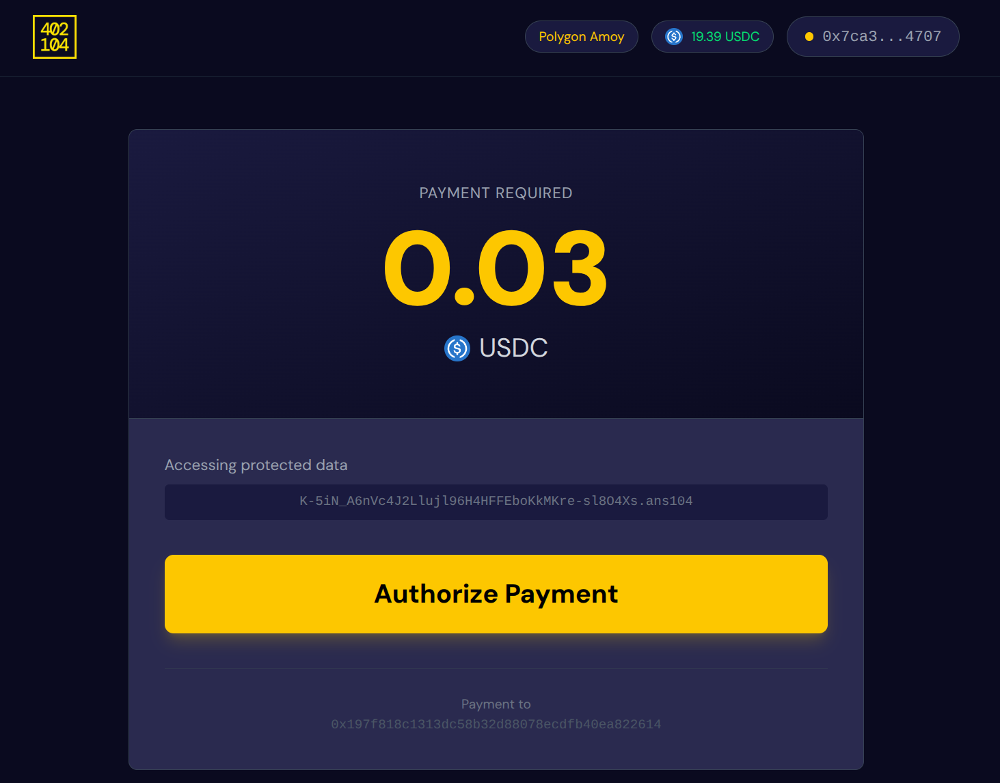

# x402 Protocol Integration

### What is the x402 protocol?

The x402 protocol is an open framework that enables machine-to-machine payments on the web by standardizing how clients and services exchange value over HTTP. Building on the HTTP 402 "Payment Required" status code, x402 establishes a clear transaction flow where a server responds to resource requests with payment instructions (including amount and recipient), the client provides payment authorization, a payment facilitator verifies and settles the transaction, and the server delivers the requested resource along with payment confirmation.&#x20;

This protocol allows automated agents, crawlers, and digital services to conduct transactions programmatically without requiring traditional accounts, subscriptions, or API keys. By creating a common language for web-based payments, x402 enables new monetization models such as pay-per-use access, micropayments for AI agents purchasing from multiple merchants, and flexible payment schemes including immediate settlement via stablecoins or deferred settlement through traditional payment rails like credit cards and bank accounts.


[The x402 Foundation](https://blog.cloudflare.com/x402/) is a collaborative initiative being established by Cloudflare and Coinbase with the mission of encouraging widespread adoption of the x402 protocol.


### x402 and xANS-104 DataItems

We are proud to be the first team that has worked on the intersection of [x402 micropayments protocol and Arweave's ANS-104 data format](https://402.load.network/). We have integrated the x402 protocol in Load's custom HyperBEAM device ([\~s3@1.0 device](../load-hyperbeam/s3-1.0-device.md)), resulting in the first ever expirable, paywalled, privately shareable ANS-104 DataItems.

The x402 micropayments have been integrated on the ANS-104 gateway sidecar level of the s3 device. [check out source code](https://app.gitbook.com/u/9f5jQHFG1jWXf1Txd6jCIxFWKHD2).

### Creating x402 paywalled private dataitems

There are two ways to create an x402 paywalled private expireable ANS-104 DataItem, the first is user friendly via the LCP dashboard, and the second is programmatic yet DIY, let's explore both methods.

#### x402 on Load Cloud Platform (LCP)

x402 has been integrated on LCP, making it possible for LCP users to create x402 paywalled, expirable links for their private objects (ANS-104 DataItems) on Load S3. The process is pretty simple and straightforward: fill in the parameters of the **Create Payment Link** request (set expiry , payee EOA, and USDC amount) and the dashboard will generate a ready-to-use x402 expirable DataItem URL.

<figure><figcaption></figcaption></figure>

\


<figure><figcaption></figcaption></figure>

#### x402 DIY

The DIY method means doing what the LCP dashboard abstracts, first you need to create a private LS3 ANS-104 Dataitem and upload it to your LCP bucket (load-s3-agent [reference](https://github.com/loadnetwork/load-s3-agent)):

```bash
curl -X POST https://load-s3-agent.load.network/upload/private \
  -H "Authorization: Bearer $load_acc_api_key" \
  -H "signed: true" \
  -H "bucket_name: $bucket_name" \
  -H "x-dataitem-name: $dataitem_name" \
  -H "x-folder-name: $folder_name" \ 
  -F "file=@path-signed-dataitem.ans104" \
  -F "content_type=application/octet-stream"
```

After that you have to generate the x402 signed shareable receipt using the HyperBEAM LS3 sidecar:

```bash
curl -X POST https://gateway.s3-node-1.load.network/sign/402 \
  -H "Authorization: Bearer $CONTACT_US" \
  -H "x-bucket-name: $bucket_name" \
  -H "x-load-acc: $load_acc_api_key" \
  -H "x-dataitem-key: $dataitem_key.ans104" \
  -H "x-402-address: $payee_eoa" \
  -H "x-402-amount: $usdc_amount" \
  -H "x-expires-minutes: $set_expiry"
```

this curl request will return a base64 string, you use it to share the x402 paywalled ANS-104 DataItem as following: `https://402.load.network/$base64_string`

\
\


<figure><figcaption></figcaption></figure>

